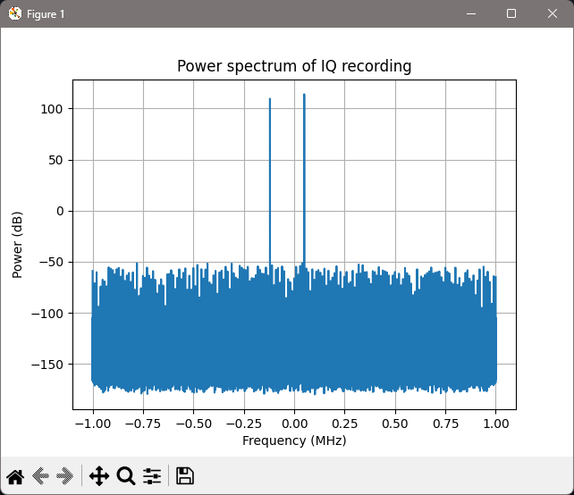

# hackrf-student-sdr-lab


Student SDR & satellite lab with HackRF One – open learning project.

I am a high school student in Georgia, teaching myself
software defined radio and satellite reception.
Using HackRF One and open source tools, I want to turn my
learning process into something other beginners can reuse. This repo
collects my notes, examples and tutorials step by step.

> I live in Tbilisi, Georgia, where SDR and HackRF are still almost
> unknown and there are very few local learning resources. With this
> project I want to create simple, practical examples and tutorials in
> both English and Georgian, so that students here can have an easier
> starting point than I did.

## Table of Contents

- [Goals](#goals)
- [Why this project matters (especially in Georgia)](#why-this-project-matters-especially-in-georgia)
- [Current Status](#current-status)
- [Repository Structure](#repository-structure)
- [Learning Notes](#learning-notes)
- [Examples](#examples)
- [Quick Start](#quick-start)
- [Planned Experiments](#planned-experiments)
- [Tools](#tools)
- [Contributing](#contributing)
- [License](#license)

## Goals

- Understand the basics of SDR, sampling and modulation in a practical way.
- Receive and decode real-world signals that are legal to receive:
  - FM broadcast
  - ADS-B from aircraft
  - Weather satellites (NOAA / Meteor)
  - Amateur satellites and other interesting signals
- Turn “invisible” radio waves into something human and visual
  (images, graphs, audio).
- Publish simple, beginner-friendly guides and scripts that others can reuse.
- Gradually provide bilingual material (English + Georgian) so local
  learners don’t get blocked by language.

## Why this project matters (especially in Georgia)

- SDR and HackRF are not widely known in Georgia.
- There are almost no local workshops, clubs, or tutorials in Georgian.
- By documenting my progress in an open way, I hope to:
  - give other students a concrete place to start,
  - show that you can explore radio and satellites even without a big lab,
  - translate key explanations and tutorials into Georgian so that people
    who are not confident in English can still learn,
  - eventually inspire small local meetups or study groups.

## Current Status

I am just starting this project.

Right now this repo contains:

- Study notes and links I use to learn the basics (`docs/` and `notes/`)
- A learning plan, roadmap, and ideas for future workshops
- Plans for future HackRF One setups and antennas
- Example Python scripts for working with IQ recordings (`examples/`)

As soon as I have access to HackRF One, I will start adding:

- GNU Radio flowgraphs
- Example scripts for decoding different signals
- Step-by-step tutorials with screenshots
- Short explanations and summaries in Georgian alongside English

## Repository Structure

A quick overview of the main folders in this project:

- `docs/` – learning plan, roadmap, HackRF study notes and experiment ideas,  
  plus conceptual notes on IQ, spectra, FM, ADS-B, and several short texts in Georgian.
- `notes/` – external links and references I use while learning SDR and satellites  
- `examples/` – small Python scripts for generating and analysing IQ recordings  
- `images/` – screenshots of spectra, waterfalls, and satellite experiments

## Learning Notes

Some of the key documentation files in `docs/`:

- [`docs/iq-and-spectra-basics.md`](docs/iq-and-spectra-basics.md)  
  Beginner notes on IQ data, spectrum and waterfall plots.

- [`docs/signal-chain-overview.md`](docs/signal-chain-overview.md)  
  High-level overview: from real radio waves, through HackRF and IQ, to software
  visualisation and decoding.

- [`docs/fm-from-iq-basics.md`](docs/fm-from-iq-basics.md)  
  How FM looks in IQ data and a simple explanation of FM demodulation.

- [`docs/adsb-from-iq-basics.md`](docs/adsb-from-iq-basics.md)  
  Basics of ADS-B aircraft signals (1090 MHz), how they look in IQ, spectrum and
  waterfall, and how they are decoded.

- [`docs/prerequisites-and-learning-path.md`](docs/prerequisites-and-learning-path.md)  
  What background knowledge is helpful and a suggested learning path for this lab
  (IQ → FM → ADS-B → satellites).

**Georgian-language notes:**

- [`docs/iq-basics-ka.md`](docs/iq-basics-ka.md)  
  Short Georgian explanation of IQ data and spectra.

- [`docs/sdr-intro-ka.md`](docs/sdr-intro-ka.md)  
  Intro to SDR and HackRF in Georgian.

- [`docs/signal-chain-ka.md`](docs/signal-chain-ka.md)  
  Signal chain from antenna to computer, explained in Georgian.

- [`docs/fm-from-iq-basics-ka.md`](docs/fm-from-iq-basics-ka.md)  
  FM fundamentals from IQ, in Georgian.

- [`docs/adsb-from-iq-basics-ka.md`](docs/adsb-from-iq-basics-ka.md)  
  ADS-B basics and aircraft signals, in Georgian.

- [`docs/prerequisites-and-learning-path-ka.md`](docs/prerequisites-and-learning-path-ka.md)  
  Learning roadmap in Georgian for local students.

These documents are written as learning notes for myself and for other
students who want to understand what SDR is really doing, in both English
and Georgian.

## Examples

Small Python scripts used for learning and visualising IQ data:

- `examples/generate_test_tone.py`  
  Create synthetic complex64 IQ files with simple test tones for experimenting
  with spectrum and waterfall plots.

- `examples/plot_spectrum.py`  
  Load an IQ file and plot its power spectrum using FFT.

- `examples/plot_waterfall.py`  
  Load an IQ file and generate a time–frequency waterfall view.

- `examples/fm_demo_from_file.py`  
  Very simple FM demodulation from an IQ recording to a mono WAV file.  
  Intended as a learning demo, not a full broadcast-quality receiver.

### Example spectrum from the test tone

After running `generate_test_tone.py` and `plot_spectrum.py` on a synthetic
IQ file, I get the following spectrum plot (two strong tones around the
centre frequency):

<p align="center">
  
</p>

(Additional full-size spectrum and waterfall screenshots are referenced from
`docs/iq-and-spectra-basics.md`.)

## Quick Start

These scripts are designed to work with any complex64 IQ recordings,
so they can be used even before I have HackRF One.

Clone the repository and install the basic Python dependencies:

```bash
git clone https://github.com/DBeria/hackrf-student-sdr-lab.git
cd hackrf-student-sdr-lab
python -m pip install -r requirements.txt
