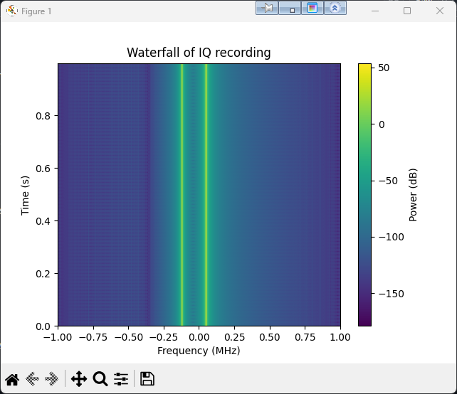

# IQ Data, Spectrum, and Waterfall – Beginner Notes

These are my personal notes for understanding what SDR really records
(IQ data) and how that turns into spectrum and waterfall plots. The
goal is to understand the concepts well enough to experiment with
HackRF One and tools like GNU Radio and Python.

This document is written for beginners, including my future self.

---

## 1. What does an SDR actually record?

A normal audio recorder stores one real number per sample:
- "how far the speaker moves at this moment"

A software defined radio (SDR) stores **complex samples** instead:
- two numbers per sample: **I** (in-phase) and **Q** (quadrature)

Each sample is:

> I(t) + j·Q(t)

where:
- **I(t)** is the in-phase component  
- **Q(t)** is the quadrature (90° shifted) component  
- **j** is the imaginary unit

You can think of it like this:

- I(t) = "how much cosine is here at this moment"  
- Q(t) = "how much sine is here at this moment"

Together, I and Q describe the **amplitude and phase** of the RF signal
around some center frequency.

An **IQ recording** is just a long list of these complex samples.

---

## 2. Why complex numbers? (light math)

The key formula is Euler's identity:

> e^{jθ} = cos(θ) + j·sin(θ)

A pure tone at frequency f₀ can be written as:

> e^{j·2π·f₀·t} = cos(2πf₀t) + j·sin(2πf₀t)

If we look at the **real part**, we get a cosine.  
If we look at the **imaginary part**, we get a sine.

When an SDR tunes to a center frequency **f_c**, it effectively moves
the RF signal down to **baseband** (around 0 Hz) by multiplying with
a complex exponential and low-pass filtering.

Conceptually, the RF signal s_RF(t) can be seen as:

> s_RF(t) ≈ Re{ s_b(t) · e^{j·2π·f_c·t} }

where:
- **s_RF(t)** is the real RF signal at frequency f_c,
- **s_b(t)** is the complex baseband signal = I(t) + j·Q(t),
- **e^{j·2π·f_c·t}** is the carrier at f_c.

The SDR gives us **s_b(t)**: this is the IQ data we work with.

With I and Q together we can get:

- **amplitude**: √(I² + Q²)  
- **phase**: atan2(Q, I)

This is very powerful for modulation, demodulation, and analysis.

---

## 3. Spectrum: "what frequencies are present?"

A **spectrum** answers this question:

> For a short time window, how much energy is there at each frequency?

To compute a spectrum from IQ:

1. Take a block of N samples from the IQ data.
2. Apply a window (e.g. Hanning) to reduce edge effects.
3. Run a **Fast Fourier Transform (FFT)** on this block.
4. Take the magnitude of the FFT result and convert to dB.

In Python (similar to my `plot_spectrum.py` script):

```python
import numpy as np

# iq: complex64 array of I + jQ samples
window = np.hanning(iq.size)
iq_win = iq * window

spectrum = np.fft.fft(iq_win)
spectrum = np.fft.fftshift(spectrum)  # move 0 Hz to centre
spectrum_db = 20 * np.log10(np.abs(spectrum) + 1e-9)

## 6. Example plots from a synthetic test tone

These are real plots generated with the scripts in `examples/`:

1. `generate_test_tone.py` – creates a complex64 IQ file with two tones  
2. `plot_spectrum.py` – draws the power spectrum  
3. `plot_waterfall.py` – draws the time–frequency waterfall

**Power spectrum of the IQ recording** – two strong tones around the centre:


**Waterfall of the same IQ recording** – the tones stay constant over time:


